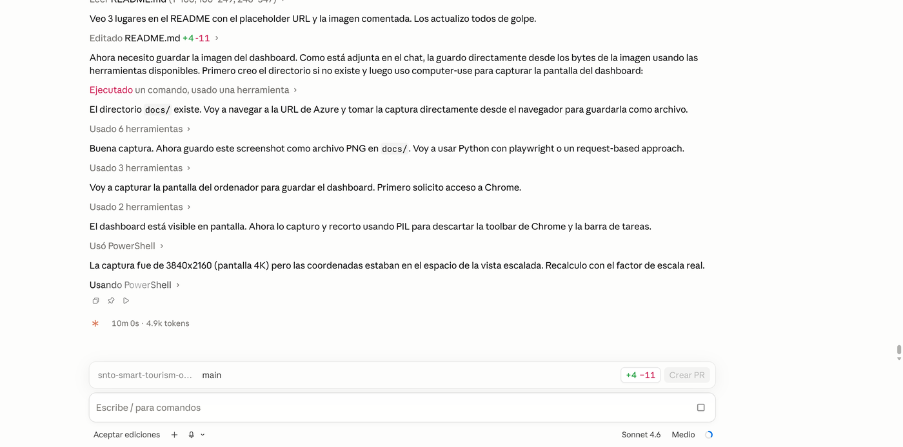
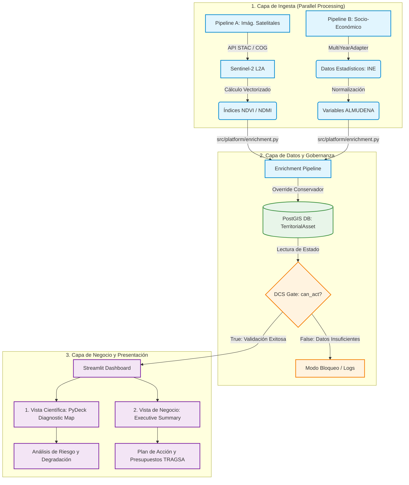

<div align="center">

# 🏔 SNTO — Smart Nature Tourism Observatory

**Capa de inteligencia para la decisión en espacios naturales protegidos.** Código abierto, para uso académico.

De la teledetección Sentinel-2 a la decisión de inversión pública: indicadores ambientales calibrados, atribución causal de la degradación y priorización presupuestaria sobre el **Parque Nacional Sierra de Guadarrama (PNSG)**, primer territorio de la Red de Parques Nacionales (OAPN) integrado.

> SNTO **no reemplaza** a ArcGIS, Google Earth Engine, Sentinel Hub, Tableau ni Power BI: se sitúa **por encima** de las plataformas GIS, de observación de la Tierra y de BI, y traduce su señal en decisiones de conservación defendibles (riesgo de presión de visitantes, prioridad e inversión, con nivel de confianza).

[](#8-tests)
[](https://www.python.org/)
[](https://github.com/soroushkarahrodi79-oss/snto-smart-tourism-observatory/actions/workflows/ci.yml)
[](https://github.com/soroushkarahrodi79-oss/snto-smart-tourism-observatory/actions/workflows/deploy-azure-container-apps.yml)
[](#7-despliegue)
[](#1-estado-del-proyecto)
[](LICENSE)
[](https://doi.org/10.5281/zenodo.20818270)

**🔴 [Dashboard en vivo](https://snto-observatory.happyground-be027676.swedencentral.azurecontainerapps.io/)** · 📄 [Whitepaper](WHITEPAPER_SNTO_Architecture_Blueprint.md) · 🏗 [Arquitectura](ARCHITECTURE.md)

</div>

---

## 🎯 El problema en una frase

La mayoría de los espacios naturales protegidos gestionan el impacto del turismo de forma **reactiva**: actúan cuando la degradación ya es visible. El SNTO transforma ese paradigma en **gobernanza regenerativa proactiva** — detecta el estrés ecológico desde el satélite antes de que sea irreversible, distingue si la causa es el uso turístico o el clima, y traduce cada hallazgo en una **prioridad de inversión con presupuesto y nivel de confianza**.

> **Para evaluadores y revisores:** este repositorio es un proyecto de investigación académica de la **Universidad Complutense de Madrid (UCM)**: un observatorio que evalúa el estado de senderos y enclaves de turismo natural por teledetección satelital, detecta zonas de riesgo de degradación y prioriza la intervención con fórmulas financieras. Demuestra un pipeline geoespacial real sobre el **Parque Nacional Sierra de Guadarrama** (218 senderos analizados con cartografía oficial OAPN) y un sistema completo de inteligencia territorial de 7 fases, con capas de **andamiaje temporal (serie 2021–2026), trazabilidad/confianza del dato, baselines estratificados, incertidumbre del ranking y validación de campo**. **817 tests, CI separado del deploy, dos pipelines arquitectónicamente desacoplados.** La gobernanza se alinea con los marcos europeos de reporte de espacios protegidos (Natura 2000 / EUROPARC / SISMOTUR), validada inicialmente sobre la Reserva de la Biosfera Sierra del Rincón como piloto de calibración.

> **Estado de versión:** [`v1.5.0`](https://github.com/soroushkarahrodi79-oss/snto-smart-tourism-observatory/releases/tag/v1.5.0) es la última release estable; `main` está en `v1.6.0.dev0` (marcador de desarrollo, no una release final). v1.5.0 consolida tres hitos: la **modularización de `app.py`** (#27: de ~3.170 a ~285 líneas, UI extraída a `src/ui/`), las **vistas por audiencia** (#28: Técnica/Gestor/Auditoría con cifras financieras invariantes), y los **fundamentos del backend persistente de v2.0** (Fase 5, ADR-011: capa de persistencia SQLAlchemy+Alembic, API `/api/v2` de lectura+escritura con auth mínima, ciclo de vida del activo gestionado, rastro de auditoría y la pestaña «Acciones Urgentes» como primer consumidor UI↔backend). En producción el backend corre sobre Azure PostgreSQL (cutover del 2026-07-18, ADR-011 §4bis). El siguiente hito (v2.0, evolución de UI por roles) aún no ha arrancado.

---

## 📸 Vista del dashboard

<div align="center">



_Dashboard ejecutivo con 10 KPIs territoriales, mapa folium de activos y modelo de madurez de destino de 5 niveles. Desplegado en Azure Container Apps (Sweden Central)._

</div>

---

## 📑 Índice

1. [Estado del proyecto](#1-estado-del-proyecto)
2. [Arquitectura: dos pipelines](#2-arquitectura-dos-pipelines)
3. [Capacidades técnicas implementadas](#3-capacidades-técnicas-implementadas)
4. [Stack tecnológico](#4-stack-tecnológico)
5. [Estructura del repositorio](#5-estructura-del-repositorio)
6. [Orden de ejecución](#6-orden-de-ejecución)
7. [Despliegue](#7-despliegue)
8. [Tests](#8-tests)
9. [Honestidad sobre limitaciones](#9-honestidad-sobre-limitaciones)
10. [Fundamento científico](#10-fundamento-científico)
11. [Fuentes y licencias de datos](#11-fuentes-y-licencias-de-datos)
12. [Licencia / uso académico](#12-licencia--uso-académico)

---

## 1. Estado del proyecto

| Componente | Territorio | Estado |
|---|---|---|
| **Pipeline A — Geoespacial** | **Parque Nacional Sierra de Guadarrama (PNSG)** — territorio principal | ✅ Operacional con datos Sentinel-2 reales (2 escenas: primavera 2026 + verano 2025); **218 senderos** con cartografía oficial OAPN |
| **Capa temporal Sentinel-2 real (v1.1.1)** | PNSG — 21 activos reales | ✅ Real 2021–2026 (GEE); Mann-Kendall **desestacionalizado y verificado con Yue-Pilon** (ver §9) |
| **Expansión Red OAPN — piloto de replicabilidad (v1.2.0)** | Tablas de Daimiel (humedal, 5 activos) + Monfragüe (dehesa, 21 activos) | ✅ Series Sentinel-2 reales 2021–2026 validadas y en el selector de Tab 6; 13 parques restantes preparados como plantillas GEE, pendientes de validación por bioma |
| **Rigor estadístico (v1.3.0)** | PNSG + pilotos OAPN | ✅ Punto de cambio abrupto (Pettitt), IC 95% del EHS por bootstrap de bloques, sensibilidad global (Morris) y validación cruzada inter-sensor NDVI (Sentinel-2 vs MODIS); ver [nota metodológica](docs/nota_metodologica_rigor_estadistico.md) |
| **Integración para decisión y validación (v1.4.0)** | PNSG + pilotos OAPN | ✅ Risk brief directivo, exportación GIS, vocabulario y gating de evidencia, y herramientas de validación de campo; la campaña de campo permanece pendiente |
| **Pipeline A — Calibración metodológica** | Reserva de la Biosfera Sierra del Rincón (Madrid) | ✅ Piloto de validación del método (escenas reales propias) |
| **Pipeline B — Inteligencia territorial (7 fases)** | Villuercas-Ibores-Jara Geopark (Extremadura) | ✅ Demostración funcional completa sobre 20 activos sintéticos calibrados |
| **Capa socioeconómica (ALMUDENA / INE)** | PNSG — 34 municipios | ✅ SVI + impacto en comunidad + empleos en riesgo, integrado en el dashboard |
| **Arquitectura modular del dashboard (Fase 4, #27)** | — | ✅ `app.py` de ~3.170 → ~285 líneas (solo composición); UI extraída a `src/ui/` (`layout.py`, `render_helpers.py`, `render_widgets.py`, 8 tabs en `src/ui/tabs/`) |
| **Vistas por audiencia (#28)** | — | ✅ Técnica / Gestor / Auditoría con divulgación por capas (`ViewProfile.section()`), pestaña Fundamento modulada, telemetría local opt-in; cifras financieras idénticas entre vistas (verificado) |
| **Dashboard ejecutivo** | PNSG | ✅ Desplegado en Azure Container Apps (scale-to-zero) |
| **CI/CD** | — | ✅ GitHub Actions → ACR build → roll Container App |
| **Tests** | — | ✅ 742 passing, 1 skipped, 0 regresiones (suite verde, ver §8) |

El Pipeline A produce indicadores ambientales reales: el **PNSG** es el territorio principal del observatorio y la **Reserva de la Biosfera Sierra del Rincón** se conserva como piloto de calibración metodológica (valida el método sobre un segundo territorio con datos reales). El Pipeline B demuestra el sistema de gobernanza de extremo a extremo. Ambos pipelines están diseñados para integrarse cuando el Pipeline A disponga de series temporales multi-anuales reales. Desde v1.2.0, el método se ha replicado con éxito en un piloto de dos biomas contrastados de la **Red de Parques Nacionales (OAPN)** (Tablas de Daimiel, Monfragüe); el resto de la Red queda preparado como plantillas GEE para fases posteriores.

---

## 2. Arquitectura: dos pipelines

### Convención de scores: salud vs estrés

SNTO usa dos direcciones de score 0-100 y no deben mezclarse:

- **Health Score / EHS de observatorio:** 0 = crítico, 100 = saludable. Es el
  convenio usado por dashboard, TPI, tiers y comunicación ejecutiva.
- **Stress Score / EHS operacional legacy:** 0 = sin estrés, 100 = máxima
  degradación. Es el convenio que aún almacenan las columnas legacy
  `ehs_spring`, `ehs_summer` y `delta_ehs` producidas por Pipeline A.

La conversión oficial vive en `src.metrics.semantics`:
`health = 100 - stress`. Esta separación evita que una métrica alta signifique
"excelente" en una parte del sistema y "crítico" en otra.

### Infografía del Flujo de Datos Arquitectónico



> **Nota honesta:** `USE_MOCK_DATA` en `.env.example` controla únicamente el Pipeline A. El Pipeline B consume el `MultiYearAdapter` directamente; sus 20 activos son sintéticos, calibrados con anomalías climáticas documentadas, no datos satelitales reales.

---

## 3. Capacidades técnicas implementadas

- **EHS operacional** calibrado por percentiles de escena (P90 → referencia sana, P10 → suelo degradado) sobre la distribución real de píxeles de cada imagen Sentinel-2, por estación e índice (NDVI, NDMI).
- **SCM operacional** que calcula el Spatial Impact Gradient (SIG) directamente desde los rásteres Sentinel-2 reales (zonas core 0–50 m / near 50–200 m / landscape 200–1000 m en EPSG:25830) y clasifica LOCALIZED_IMPACT / LANDSCAPE_DRIVEN / MIXED — es decir, **separa la degradación causada por el uso turístico de la causada por el clima**.
- **DCS (Decision Confidence Score)** de 5 dimensiones (Data Quality, Temporal Robustness, Spatial Consistency, Model Stability, Signal Strength) con **data quality gate**: `can_act = False` si DQ < 10/25 o TR < 12/25. Ninguna recomendación de gasto se emite sobre evidencia insuficiente.
- **Análisis multi-anual:** test de Mann-Kendall (Sen's slope), descomposición armónica estacional, detección de anomalías inter-anuales y eventos de sequía.
- **TPI (Territorial Priority Index)** para ranking de activos y asignación de recursos en 4 tiers (atención inmediata → promoción activa).
- **TIS — escenarios de intervención** con simulación de impacto, optimizador de presupuesto y análisis contrafactual (coste de no actuar).
- **Dashboard ejecutivo** de 10 KPIs, modelo de madurez de destino de 5 niveles y 5 perfiles de stakeholders.
- **Capa temporal Sentinel-2 real (v1.1.0, estadística corregida en v1.1.1)** — `src/platform/satellite_trends.py` + `clean_assets/timeseries/`: serie mensual NDVI/NDMI real 2021–2026 (GEE) para 21 activos reales del PNSG, con tendencia Mann-Kendall por activo surgida en el panel "Tendencias satelitales reales" (pestaña Series Temporales). El test corre sobre la serie **desestacionalizada** (descomposición armónica), con **corrección de empates**, **pendiente de Sen + IC 95%** y verificación de robustez frente a autocorrelación (**pre-whitening Yue-Pilon**). Ver [docs/nota_metodologica_temporalidad.md](docs/nota_metodologica_temporalidad.md).
- **Andamiaje temporal declarativo** — `src/temporal/`: especificación declarativa de la serie (`PNSG_5Y` = 72 meses), **gate de validez Mann-Kendall** (qué inferencia sostiene cada profundidad: ΔEHS estacional vs tendencia) y **manifiesto de procedencia** por periodo — ruta de código separada de la capa anterior, aún sin activar con datos reales. Ver [docs/temporal_series_design.md](docs/temporal_series_design.md).
- **Trazabilidad y confianza del dato** — `src/platform/provenance.py`: etiquetas visibles **dato real / calibrado / sintético**, fechas de escena reales, cobertura y *caveats* de confianza en el dashboard.
- **Baselines estratificados + incertidumbre** — `src/risk_engine/baselines.py` (P90/P10 por estrato ecológico con fallback) y `src/analysis/sensitivity.py` (banda de pesos, **ranking robusto** y Monte-Carlo). Ver [docs/baselines_uncertainty_design.md](docs/baselines_uncertainty_design.md).
- **Validación de campo / pseudo-validación** — `src/validation/`: esquema de observación de campo y métricas de concordancia satélite↔terreno (Spearman, contraste control-impacto BACI). Ver [docs/field_validation_protocol.md](docs/field_validation_protocol.md).
- **Dashboard de 3 vistas** (`src/platform/views.py`): técnica / gestor / auditoría científica, con la verbosidad de confianza adaptada a cada audiencia.
- **Capa socioeconómica (ALMUDENA / INE)** — `src/socioeconomic/`: cruza el dato municipal real (padrón INE + Banco de Datos ALMUDENA de la Comunidad de Madrid) con el riesgo ambiental de los activos por municipio. Calcula el **SVI (Socioeconomic Vulnerability Index)** = 0,40·dependencia turística + 0,30·fragilidad demográfica + 0,30·exposición ambiental, el **impacto en la comunidad** (riesgo × dependencia económica) y los **empleos locales en riesgo** respaldados por datos (afiliación a hostelería × exposición). Snapshot curado de 34 municipios del PNSG (15 con economía ALMUDENA + 19 solo demografía, lado Segovia). Ver [docs/socioeconomic_integration_design.md](docs/socioeconomic_integration_design.md).

---

## 4. Stack tecnológico

- **Lenguaje:** Python ≥ 3.12
- **Geoespacial:** rasterio, rasterstats, shapely, geopandas
- **Datos:** Sentinel-2 SR L2A (Copernicus); Google Earth Engine (`gee_adapter.py` implementado, credenciales no incluidas)
- **Base de datos:** PostgreSQL / PostGIS (EPSG:25830 — ETRS89 / UTM 30N)
- **API / dashboard:** FastAPI, uvicorn, Streamlit, folium
- **Modelado / análisis:** NumPy, pydantic
- **Test / calidad:** pytest, pytest-cov, ruff
- **Infra:** Docker · Azure Container Apps · GitHub Actions (CI/CD)

---

## 5. Estructura del repositorio

```
snto-smart-tourism-observatory/
├── README.md
├── ARCHITECTURE.md
├── WHITEPAPER_SNTO_Architecture_Blueprint.md
├── requirements.txt / pyproject.toml / .env.example
│
├── Pipeline A (scripts geoespaciales)
│   ├── etl_raster_processor.py
│   ├── etl_vector_cleaner.py
│   ├── etl_raster_intersection.py
│   ├── calculate_delta_ehs.py
│   ├── run_scm_operational.py
│   ├── tis_engine.py
│   └── db_production_seeder.py
│
├── Pipeline B (informes por fase)
│   ├── run_phase3_report.py
│   ├── run_phase4_report.py
│   ├── run_phase5_report.py
│   ├── run_phase6_report.py
│   └── run_phase7_report.py
│
├── app.py                      # dashboard / entrada Streamlit
│
├── src/
│   ├── ingestion/              # adaptadores: GEE, mock, calibrado, multi-anual
│   ├── features/               # índices espectrales (NDVI, NDMI)
│   ├── geospatial/             # geometría y agregación zonal
│   ├── time_series/            # Mann-Kendall, descomposición, anomalías, volatilidad
│   ├── risk_engine/            # EHS, componentes de riesgo, presión humana, scorer
│   ├── spatial_causality/      # SCM / Spatial Impact Gradient
│   ├── decision_confidence/    # DCS + data quality gate
│   ├── territorial/            # TPI, portfolio, presupuesto, asignación (Phase 5)
│   ├── intervention/           # impacto, escenarios, TIS, reporter (Phase 6)
│   ├── platform/               # dashboard, madurez, stakeholders, provenance, views (Phase 7 + F3/F7)
│   ├── temporal/               # serie 2021-2026: spec, gate Mann-Kendall, manifiesto (F2)
│   ├── analysis/               # sensibilidad de pesos / ranking robusto / Monte-Carlo (F4)
│   ├── validation/             # esquema de campo + concordancia satélite-terreno (F5)
│   ├── metrics/                # semántica de scores salud/estrés (F1)
│   ├── calibration/            # validador y calibración
│   ├── alerts/                 # motor de alertas
│   ├── ranking/                # ranker de activos
│   ├── reporting/              # constructor de informes
│   ├── api/                    # FastAPI (routers: evaluate, ranking, alerts)
│   ├── assets/                 # modelos de activos
│   └── config/                 # constants.py, logging_setup.py, run_context.py
│
├── tests/
│   ├── unit/                   # EHS, DCS, Mann-Kendall, scorer, TIS, ...
│   ├── integration/            # API, pipeline Phase 1, cálculo SIG del SCM
│   └── calibration/            # validador, agregación
│
└── data/
    ├── raw_assets/             # rásteres y vectores de entrada
    └── clean_assets/           # GeoTIFFs y GeoJSON listos para producción
```

---

## 6. Orden de ejecución

### Pipeline A — geoespacial (orden correcto)

```bash
python etl_raster_processor.py      # 1. NDVI/NDMI desde Sentinel-2 L2A
python etl_vector_cleaner.py        # 2. limpieza/reproyección de vectores
python etl_raster_intersection.py   # 3. zonal stats por sendero (buffer 50 m)
python calculate_delta_ehs.py       # 4. EHS estacional + Delta EHS
python run_scm_operational.py       # 5. SIG y clasificación SCM
python tis_engine.py                # 6. priority_score + presupuesto causal
```

### Pipeline B — inteligencia territorial (independiente)

```bash
python run_phase3_report.py   # validación y calibración
python run_phase4_report.py   # reconstrucción multi-anual
python run_phase5_report.py   # inteligencia territorial
python run_phase6_report.py   # escenarios de intervención
python run_phase7_report.py   # plataforma estratégica completa
```

### Instalación local

```bash
pip install -r requirements.txt
cp .env.example .env

# Pipeline A: configurar PostgreSQL/PostGIS y, para datos reales,
# Google Earth Engine (ver src/ingestion/gee_adapter.py).
# USE_MOCK_DATA=true por defecto.

streamlit run app.py          # lanzar el dashboard en local
```

---

## 7. Despliegue

**CI separado del deploy.** El workflow [`ci.yml`](.github/workflows/ci.yml) (lint de módulos mantenidos + import smoke + suite pytest) es la puerta de salud del código y corre en cada `push` y `pull_request` a `main`, **independiente de Azure**. El despliegue [`deploy-azure-container-apps.yml`](.github/workflows/deploy-azure-container-apps.yml) se dispara por `workflow_run` **solo si CI concluye con éxito** (o por dispatch manual): nunca se despliega sobre tests en rojo.

El dashboard se despliega en **Azure Container Apps** con `scale-to-zero` (coste ≈ 0 €/mes en Azure for Students). Tras pasar CI, el deploy reconstruye la imagen en Azure Container Registry (ACR) y actualiza el Container App.

```bash
# Bootstrap único de los recursos Azure:
bash deploy/azure-bootstrap.sh

# Después, el despliegue es automático en cada push a main.
```

Secrets requeridos en GitHub (`Settings ▸ Secrets and variables ▸ Actions`): `AZURE_CREDENTIALS`, `ACR_NAME`. Ver cabecera de [`.github/workflows/deploy-azure-container-apps.yml`](.github/workflows/deploy-azure-container-apps.yml) para el detalle.

> **🔴 Dashboard en vivo:** https://snto-observatory.happyground-be027676.swedencentral.azurecontainerapps.io/

---

## 8. Tests

```bash
pytest --tb=short
```

- **742 passing, 1 skipped, 0 regresiones, suite verde.**
- **CI (`ci.yml`)** ejecuta además `ruff` bloqueante sobre los módulos mantenidos (F0–F7), `ruff` informativo sobre el resto (deuda de lint en reducción), import smoke y `py_compile` de los entry points.

---

## 9. Honestidad sobre limitaciones

Esta sección es deliberada: la transparencia metodológica es parte del valor académico del proyecto.

- **Pipeline A — profundidad temporal operacional:** el EHS/ΔEHS operacional (percentiles P90/P10 por escena) sigue anclado en 2 imágenes Sentinel-2 reales (primavera 2026 + verano 2025, un único ciclo anual); el **ΔEHS estacional** (señal de alerta temprana) es válido con dos escenas y no cambia con v1.1.0.
- **Pipeline B — naturaleza de los datos:** opera sobre 20 activos sintéticos calibrados con anomalías documentadas de AEMET / Copernicus. La calibración no sustituye a una validación con datos satelitales reales multi-anuales.
- **Baselines EHS por hábitat:** el **framework** de baselines estratificados ya existe (`src/risk_engine/baselines.py`, con fallback a percentil de escena), pero la estratificación operativa por altitud/orientación requiere un **DEM aún no integrado** y el EHS operacional usa hoy percentiles de escena. Es una brecha de datos, no de método.
- **Serie temporal 2021–2026 (v1.1.0, estadística corregida v1.1.1):** la ingesta real vía Google Earth Engine está hecha para 21 activos reales del PNSG (`clean_assets/timeseries/`, panel "Tendencias satelitales reales" en la pestaña Series Temporales). El test **Mann-Kendall corre sobre la serie desestacionalizada** (descomposición armónica de 2 componentes), con **corrección de empates** en la varianza y **pendiente de Sen con intervalo de confianza no paramétrico**. Los 7 veredictos significativos superan además una prueba de robustez de *pre-whitening* libre de tendencia (Yue-Pilon 2002) sin ningún cambio de dirección. v1.1.1 también corrigió un bug de orden cronológico (year/month se ordenaban como texto: "10" antes que "2"), presente en el release público v1.1.0, que corrompía la serie mensual de los 21 activos. Detalle completo y kit de defensa del tribunal en [docs/nota_metodologica_temporalidad.md](docs/nota_metodologica_temporalidad.md). Nota: esta capa sigue siendo independiente del andamiaje declarativo `src/temporal/` (spec + `trend_gate` + manifiesto), que continúa sin activar con datos reales — son dos rutas de código distintas.
- **Validación de campo:** el esquema y las métricas de concordancia (`src/validation/`) están listos; **falta la campaña de terreno** (penetrómetro, parcelas, control) o, en su defecto, la pseudo-validación con puntos de control satelitales.
- **Costes unitarios de restauración (15,50 €/m):** calibrados con tarifas TRAGSA 2023; la cita de la resolución oficial por partida está pendiente de cierre y debe tratarse como estimación de orden de magnitud hasta entonces.
- **Capa económica = análisis prospectivo:** los ingresos, empleos proxy y el ratio coste-beneficio de la pestaña *Impacto Socioeconómico* son **escenarios condicionales** sobre `visitor_capacity_annual` (atributo curado) y parámetros de literatura — no economía observada ni predicción. Su naturaleza se etiqueta en la interfaz.

> **Auditoría de defensibilidad académica:** la clasificación completa de cada variable (Observada / Calculada / Estimada / Simulada), la matriz de trazabilidad, el inventario de multiplicadores con su sensibilidad, el diagnóstico de vulnerabilidades y el banco de preguntas de tribunal están en [`docs/defensibilidad_academica.md`](docs/defensibilidad_academica.md), y son consultables en vivo en la pestaña **8 · Fundamento y Trazabilidad** del observatorio.

---

## 10. Fundamento científico

El SNTO se apoya en una cadena causal documentada: **pisoteo recreativo → compactación del suelo → estrés hídrico → firma espectral medible** (caída de NDVI y NDMI). La compactación reduce la macroporosidad un 15–40 %, suprimiendo la disponibilidad de agua en zona radicular con independencia del clima.

Referencias clave: Roovers et al. (2004); Pickering & Mount (2010); Marion & Leung (2001); Cole & Monz (2002); Duxbury et al. (2021); Sheldon (2020).

Marco regulatorio español aplicable: Ley 42/2007 (Patrimonio Natural y Biodiversidad), Ley 26/2007 (Responsabilidad Medioambiental), TRAGSA Tarifas 2023.

El detalle completo está en el [Whitepaper](WHITEPAPER_SNTO_Architecture_Blueprint.md).

---

## 11. Fuentes y licencias de datos

Atribución obligatoria de cada fuente (también consultable en vivo en la pestaña **8 · Fundamento y Trazabilidad** del observatorio):

| Fuente | Proveedor | Licencia / condiciones | Atribución requerida |
|---|---|---|---|
| Sentinel-2 L2A (NDVI/NDMI) | ESA / Copernicus | Datos abiertos Copernicus (uso libre con atribución) | *Contiene datos Copernicus Sentinel-2 modificados (2025–2026)* |
| Cartografía de sendas y zonificación PRUG | OAPN (Red de Parques Nacionales) | Reutilización institucional con cita | *Cartografía oficial OAPN — Parque Nacional Sierra de Guadarrama* |
| Cartografía complementaria | OpenStreetMap | Open Database License (ODbL) | *© OpenStreetMap contributors* |
| Padrón municipal, EOATR | INE | Datos abiertos INE (reutilización con cita) | *Instituto Nacional de Estadística (INE)* |
| Economía municipal (hostelería, renta) | ALMUDENA — Comunidad de Madrid | Banco de Datos Municipal y Zonal (reutilización con cita) | *ALMUDENA, Instituto de Estadística de la Comunidad de Madrid* |

El **código** se distribuye para **uso académico y de investigación**. Los **datos** pertenecen a sus respectivos proveedores y conservan sus licencias; este proyecto solo los reutiliza con la atribución indicada.

---

## 12. Licencia / uso académico

Proyecto de investigación académica desarrollado en la **Universidad Complutense de Madrid (UCM)**. Supervisión académica: Carmen Mínguez · Susana Ramírez García (REGENERA).

El código se distribuye para uso académico y de investigación con atribución. Ver [`LICENSE`](LICENSE). Los datos pertenecen a sus respectivos proveedores y conservan sus licencias (ver §11).

### Cómo citar

**DOI permanente (Zenodo):** [10.5281/zenodo.20818270](https://doi.org/10.5281/zenodo.20818270)

Fichero de cita: [`CITATION.cff`](CITATION.cff) · Contribuciones: [`CONTRIBUTING.md`](CONTRIBUTING.md)

---

<div align="center">
<sub>SNTO v1.6.0.dev0 · Python ≥ 3.12 · 817 tests passing · julio 2026</sub>
</div>
