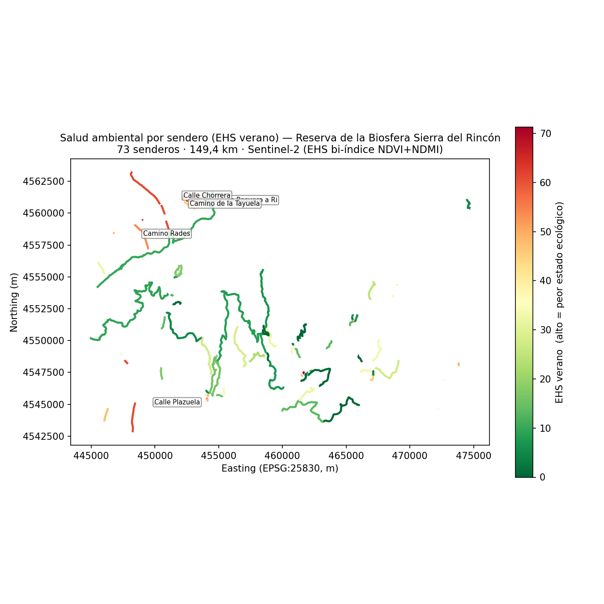
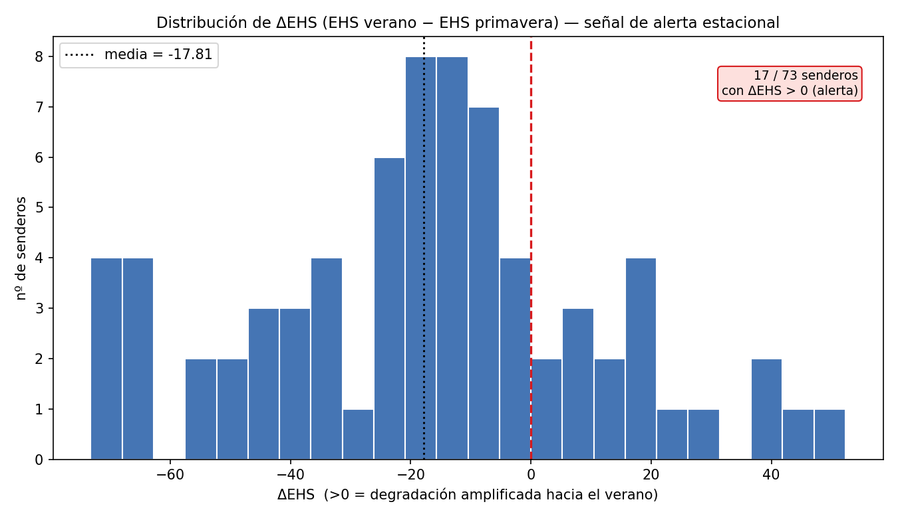
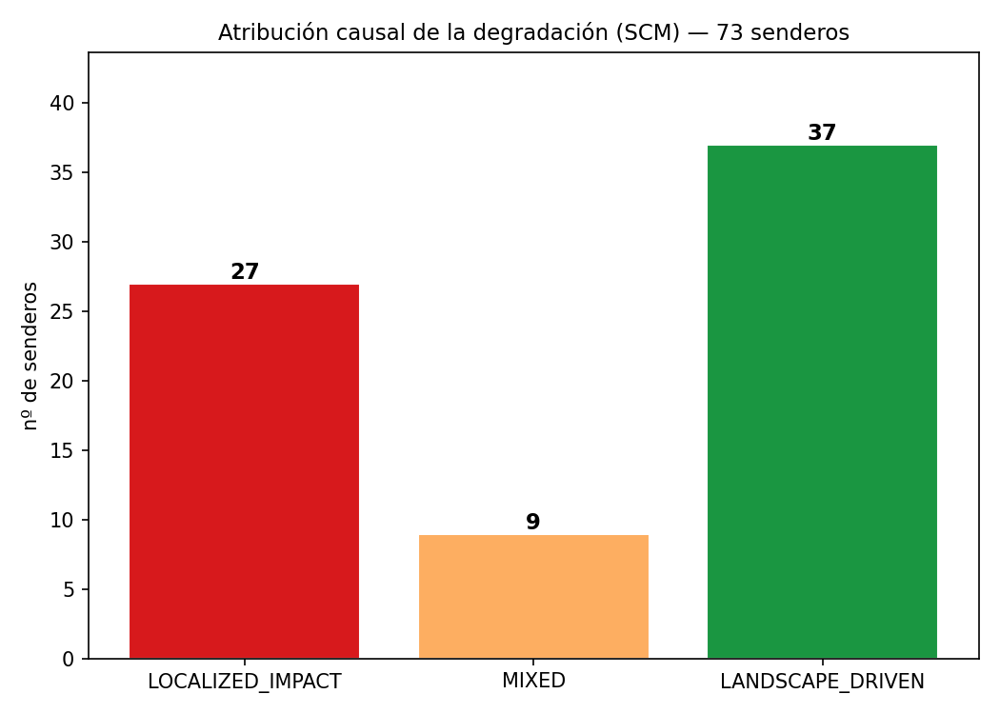

# Gobernanza Inteligente y Transición Regenerativa en la Reserva de la Biosfera Sierra del Rincón

### Hoja de Ruta para la Candidatura a la Fase I de la Carta Europea de Turismo Sostenible (CETS)

**Trabajo Fin de Máster** · Sistema técnico: SNTO — *Smart Natural Tourism Observatory*
Autor: Soroush Karahrodi · Dirección: Carmen Mínguez / Susana Ramírez García (REGENERA) — Universidad Complutense de Madrid · junio 2026

> **Nota de uso.** Borrador integrador de la memoria. Reúne en un solo hilo argumental los tres documentos de soporte del proyecto: la descripción del sistema (`README.md`), la tabla de correspondencia con la CETS (`docs/CETS_Phase1_correspondence.md`) y la nota metodológica sobre alcance temporal (`docs/nota_metodologica_temporalidad.md`). Las marcas `[INSERTAR: …]` señalan datos empíricos reales de Sierra del Rincón que deben incorporarse desde la ejecución del Pipeline A; no se han rellenado con cifras inventadas.

---

## Resumen

Este trabajo presenta el diseño, implementación y validación del **Smart Natural Tourism Observatory (SNTO)**, una plataforma de inteligencia territorial de código abierto que transforma la gestión de destinos de turismo natural de un paradigma reactivo a uno de **gobernanza regenerativa proactiva**. El sistema ingiere imágenes satelitales Sentinel-2, las convierte en indicadores ambientales calibrados, distingue la degradación de origen antrópico de la de forzamiento climático, y traduce el diagnóstico en una priorización de inversión pública con presupuesto y nivel de confianza explícitos. Se aplica como **hoja de ruta para la candidatura a la Fase I de la CETS** de la Reserva de la Biosfera Sierra del Rincón (Madrid), demostrando la correspondencia entre las capacidades del sistema y los requisitos de acreditación de la EUROPARC Federation.

**Palabras clave:** turismo regenerativo, gobernanza inteligente, teledetección, Sentinel-2, Carta Europea de Turismo Sostenible, reservas de la biosfera, NDVI, inteligencia territorial.

---

## 1. Introducción y justificación

[INSERTAR: contexto personal/académico de partida y motivación.]

La gestión del turismo en espacios naturales protegidos afronta una tensión estructural: el turismo es a la vez fuente de financiación de la conservación y vector de presión sobre los ecosistemas que lo sostienen. Los modelos de gestión predominantes son **reactivos** — intervienen cuando la degradación ya es visible sobre el terreno, cuando su reversión es más costosa y, a menudo, parcial.

El paradigma del **turismo regenerativo** (Duxbury et al., 2021; Sheldon, 2020) propone superar la mera sostenibilidad ("no dañar") hacia una lógica de mejora neta del territorio. Sin embargo, este marco carece con frecuencia de instrumentación cuantitativa: faltan sistemas capaces de **medir objetivamente** el estado regenerativo de un destino y de **anticipar** la presión antes de que sea irreversible.

El presente trabajo aborda esa brecha mediante el SNTO, articulado sobre el caso de la Reserva de la Biosfera Sierra del Rincón y su aspiración a la acreditación CETS Fase I.

## 2. Objetivos

**Objetivo general.** Diseñar y validar un sistema de inteligencia territorial que instrumente la transición regenerativa de un destino de turismo natural y soporte técnicamente su candidatura a la Fase I de la CETS.

**Objetivos específicos.**
1. Construir un pipeline geoespacial que derive indicadores de salud ambiental (EHS) a partir de imágenes Sentinel-2 reales de Sierra del Rincón.
2. Desarrollar un módulo de atribución causal (SCM) que distinga la degradación antrópica localizada del forzamiento climático paisajístico.
3. Implementar un marco de priorización (TPI), simulación de intervenciones (TIS) y confianza de la decisión (DCS) para la asignación de recursos de conservación.
4. Establecer la correspondencia entre los outputs del SNTO y los requisitos y principios de la CETS Fase I.
5. Desplegar una plataforma de visualización ejecutiva accesible a los actores del territorio.

## 3. Marco teórico

### 3.1 Turismo regenerativo y gobernanza inteligente
[INSERTAR: desarrollo del marco regenerativo y su relación con la gobernanza de datos. Base: Duxbury et al. 2021; Sheldon 2020.]

### 3.2 La Carta Europea de Turismo Sostenible (CETS)
La CETS, gestionada por la EUROPARC Federation, es un marco de acreditación voluntaria para espacios protegidos estructurado en tres fases. La **Fase I** acredita al espacio protegido mediante un dosier compuesto por **Diagnóstico, Estrategia y Plan de Acción a cinco años**, elaborados en el seno de un **Foro** participativo y un **Grupo de Trabajo**. Los compromisos del espacio se articulan sobre **diez principios** (ver §6 y Anexo B) y exigen **mejora continua mediante seguimiento e informe periódico de resultados**.

### 3.3 Teledetección aplicada a la salud de la vegetación
La cadena causal que fundamenta el sistema es: **pisoteo recreativo → compactación del suelo → estrés hídrico → firma espectral medible**. La compactación reduce la macroporosidad del suelo entre un 15 % y un 40 % (Roovers et al., 2004; Pickering & Mount, 2010), suprimiendo la disponibilidad hídrica en zona radicular con independencia de las condiciones climáticas. Este proceso produce una caída detectable de NDVI (vigor fotosintético) y NDMI (contenido hídrico), cuya escala espacial de impacto se sitúa en 0–50 m del eje del sendero (Marion & Leung, 2001; Cole & Monz, 2002).

## 4. Metodología

### 4.1 Arquitectura: dos pipelines desacoplados
El sistema se organiza en dos pipelines arquitectónicamente separados, que materializan en el propio código la frontera entre dato real y demostración:

- **Pipeline A — Geoespacial (datos reales, Sierra del Rincón):** procesa imágenes Sentinel-2 L2A reales hasta producir EHS operacional, ΔEHS estacional, clasificación causal SCM y presupuesto de restauración.
- **Pipeline B — Inteligencia territorial (demostración, Villuercas-Ibores-Jara):** opera sobre 20 activos sintéticos calibrados con anomalías climáticas documentadas (AEMET/Copernicus) para demostrar las fases 3–7 del sistema (reconstrucción histórica, TPI, TIS, contrafactual, plataforma ejecutiva).

*(Detalle completo del flujo y stack en `README.md`, §2–§4.)*

### 4.2 Indicadores y modelos
- **EHS (Environmental Health Score):** índice sintético 0–100 (convención invertida: alto = peor estado), anclado por percentiles de escena (P90/P10) sobre la distribución real de píxeles de cada imagen, lo que lo hace comparable entre estaciones y activos.
- **SCM (Spatial Causality Module):** calcula el Spatial Impact Gradient (SIG) comparando el corredor del sendero (core 0–50 m) con el fondo de paisaje (200–1000 m); clasifica `LOCALIZED_IMPACT` / `LANDSCAPE_DRIVEN` / `MIXED`.
- **DCS (Decision Confidence Score):** evalúa la fiabilidad de cada recomendación en cinco dimensiones, con un *data quality gate* que impide recomendar acción sobre evidencia insuficiente.
- **TPI / TIS:** priorización territorial en 4 tiers y simulación de escenarios de intervención con optimización presupuestaria y análisis contrafactual.

*(Fórmulas completas en `README.md` §3 y en el whitepaper.)*

### 4.3 Alcance temporal y validez del análisis de tendencia
El sistema integra dos análisis temporales que **no deben confundirse**, y cada pipeline emite únicamente la inferencia que su profundidad temporal sostiene:

- Sobre el **Pipeline A** (dos escenas reales, primavera y verano de un año), el resultado temporal es el **ΔEHS estacional** = EHS_verano − EHS_primavera, un **contraste pareado válido con dos observaciones** que actúa como señal de alerta temprana de presión antrópica. El Pipeline A **no aplica Mann-Kendall**, porque sobre dos observaciones el test carecería de potencia estadística.
- La **detección de tendencia inter-anual** (Mann-Kendall + pendiente de Sen) se **demuestra sobre el Pipeline B**, donde la profundidad multi-anual lo justifica, y se presenta como **capacidad del sistema**, nunca como hallazgo empírico sobre Sierra del Rincón.

Esta separación es una decisión de diseño deliberada y constituye la principal salvaguarda metodológica del trabajo. *(Desarrollo completo y tabla de frontera de afirmaciones en `docs/nota_metodologica_temporalidad.md`.)*

## 5. Resultados

### 5.1 Pipeline A — Sierra del Rincón (datos reales)

Se analizaron **73 senderos** (longitud total **149,4 km**) dentro de la Reserva de la Biosfera Sierra del Rincón, derivados de OpenStreetMap (vías con `highway = path | footway | track | bridleway` y etiqueta de nombre, disueltas por nombre) y evaluados sobre dos escenas Sentinel-2 L2A reales (verano: agosto 2025; primavera: abril 2026). El cómputo se ejecutó en modo fichero (`run_pipeline_a_filemode.py`), reutilizando la misma matemática de `calculate_delta_ehs.py` y `run_scm_operational.py` sin dependencia de PostGIS, con **EHS bi-índice (NDVI + NDMI a peso 0,5/0,5)**.

**Salud ambiental (EHS, escala 0–100; alto = peor estado).** EHS de verano: media **27,6**, máximo **71,3**, mínimo 0,0. Los valores son moderados en promedio, consistentes con una masa vegetal mayoritariamente sana en el conjunto del territorio, con focos puntuales de estrés acusado.

**Señal de alerta estacional (ΔEHS = EHS_verano − EHS_primavera).** Media territorial **−17,8** (recuperación estacional neta), pero **17 de 73 senderos (23 %) presentan ΔEHS > 0**, es decir, degradación amplificada hacia el verano — la señal de alerta temprana que el sistema busca. Los 5 senderos con mayor degradación estacional son:

| Sendero | ΔEHS | EHS_verano | Clasificación SCM |
|---|---|---|---|
| Calle Plazuela | +52,3 | 62,2 | LOCALIZED_IMPACT |
| Camino Rades | +42,9 | 53,9 | LOCALIZED_IMPACT |
| Camino de Rosuero a Riofrío de Riaza | +40,9 | 64,4 | LOCALIZED_IMPACT |
| Calle Chorrera | +40,9 | 64,1 | LOCALIZED_IMPACT |
| Camino de la Tayuela | +27,0 | 45,8 | MIXED |

**Atribución causal (SCM).** De los 73 senderos: **27 LOCALIZED_IMPACT** (impacto antrópico dominante, factor causal 1,0), **9 MIXED** (0,5) y **37 LANDSCAPE_DRIVEN** (forzamiento climático, 0,0); 0 sin dato. Que **4 de los 5 senderos más degradados** sean `LOCALIZED_IMPACT` es coherente con la hipótesis del sistema: la degradación más severa se concentra donde el gradiente espacial delata presión de uso, no clima. (El SCM usa solo NDVI por diseño, por lo que su clasificación es idéntica con o sin NDMI — una útil prueba de consistencia.)

**Presupuesto de restauración (indicativo).** Aplicando `B = longitud × 15,50 €/m × (EHS_verano/100) × factor_causal`, el presupuesto total imputable a presión turística asciende a **≈ 205.296 €**. Es una estimación de orden de magnitud (ver limitaciones §7.2).

> **Provenance y caveats (honestidad metodológica):**
> 1. **Conjunto de senderos.** Procede de OSM, no del conjunto curado original de 20 activos; es plenamente reproducible desde fuentes abiertas, pero el inventario difiere.
> 2. **EHS bi-índice.** Los rásters se regeneraron desde los productos SAFE para escribir un NDMI real desde la banda SWIR (B11) — corrigiendo un *placeholder* a ceros en la versión previa; el EHS de §5.1 combina NDVI y NDMI al 50/50 como en el diseño.
> 3. **Presupuesto sin índice de tráfico.** En modo fichero no hay `traffic_index`; el `priority_score` se aproximó por el EHS_verano. El coste unitario TRAGSA (15,50 €/m) es estimación de orden de magnitud pendiente de cita oficial.
> 4. **ΔEHS inter-anual.** Las dos escenas pertenecen a años distintos (verano 2025 / primavera 2026); el contraste es estacional, no una serie temporal — coherente con §4.3.

*(Resultados completos por sendero en `data/outputs/pipeline_a_results.csv`; resumen en `pipeline_a_summary.json`.)*

**Figura 5.1 — Salud ambiental por sendero (EHS verano).**

*Senderos coloreados por EHS de verano (verde = sano, rojo = degradado). Los focos rojos se concentran en accesos y senderos perimetrales de uso intenso; los 5 de mayor degradación estacional aparecen etiquetados.*

**Figura 5.2 — Distribución de ΔEHS (señal de alerta estacional).**

*La media territorial es negativa (recuperación neta), pero la cola derecha (ΔEHS > 0) reúne 27 de 73 senderos que se degradan hacia el verano — la población objetivo de la intervención preventiva.*

**Figura 5.3 — Atribución causal (SCM).**

*Reparto de los 73 senderos entre impacto antrópico localizado, mixto y forzamiento de paisaje (climático). Solo los dos primeros generan obligación presupuestaria local.*

*(Figuras reproducibles con `python make_pipeline_a_figures.py`.)*

### 5.2 Pipeline B — capacidades demostradas
La demostración sobre 20 activos sintéticos calibrados valida de extremo a extremo la cadena analítica: reconstrucción histórica multi-anual, detección de tendencia (Mann-Kendall), descomposición armónica estacional, DCS con *gate* de calidad, ranking TPI en 4 tiers, cinco escenarios de intervención (A–E) con análisis contrafactual, e informe ejecutivo de 10 KPIs para 5 perfiles de stakeholders. El caso de validación de calibración (Masatrigo) arroja un DCS de 78,7 (clasificación HIGH), confirmando el comportamiento del *gate*. La suite de pruebas comprende **266 tests** sin regresiones.

### 5.3 Plataforma desplegada
El dashboard ejecutivo se despliega en Azure Container Apps con *scale-to-zero* (coste operativo ≈ 0 € en Azure for Students), integra los 10 KPIs territoriales y el modelo de madurez de destino de 5 niveles, e incorpora una capa de explicabilidad de cada decisión (escenario elegido/rechazado/por qué/confianza). [INSERTAR: URL pública y captura.]

## 6. Correspondencia CETS Fase I ↔ SNTO

El núcleo argumental del trabajo es la correspondencia entre las capacidades del SNTO y los requisitos de la Fase I. El sistema responde de forma **fuerte y diferencial** a los dos pilares técnicamente más exigentes — la **monitorización ambiental objetiva** (Diagnóstico) y la **minimización de la huella ecológica** (principio 3 de la Carta) — y da **soporte instrumental** a la gobernanza participativa (principio 1, Foro), sin sustituirla.

Síntesis de cobertura por bloque (detalle completo y mapeo de los 10 principios en `docs/CETS_Phase1_correspondence.md`, con redacción literal verificada contra el Apéndice 1 del texto oficial de la Carta):

| Bloque CETS | Cobertura SNTO | Madurez (1–5) |
|---|---|---|
| Monitorización ambiental (Diagnóstico) | Completa, datos reales | 4 |
| Atribución de huella ecológica | Completa, datos reales | 4 |
| Priorización y Plan de Acción | Demostrada (datos sintéticos) | 3 |
| Gobernanza / Foro | Instrumental | 2 |
| Socioeconómico | Débil | 2 |
| Transparencia / seguimiento | Operacional y pública | 4 |

## 7. Discusión

### 7.1 Aportaciones
El SNTO *es*, en sí mismo, el sistema de monitorización objetiva y de cuantificación de huella ecológica que la Fase I exige, superando el estándar habitual (cualitativo) con indicadores espectrales reales y atribución causal del impacto. La separación arquitectónica de pipelines y el *data quality gate* del DCS introducen un grado de honestidad metodológica poco frecuente en sistemas de apoyo a la decisión.

### 7.2 Limitaciones
De forma explícita y deliberada:
- **Profundidad temporal del Pipeline A:** una sola anualidad real; la serie multi-anual (GEE 2021–2025) es trabajo en curso (ver `docs/GEE_setup_timebox.md`). El método de tendencia está implementado; lo que se acota es sobre qué territorio se afirma un hallazgo frente a una capacidad.
- **Banda NDMI (resuelto durante el desarrollo):** la versión inicial de los rásters tenía la banda NDMI a cero (un *placeholder* en `prepare_raster.py`); se corrigió el script para computar NDMI desde la banda SWIR B11 y se regeneraron ambas escenas, de modo que las cifras de §5.1 ya son bi-índice. Se documenta como trazabilidad del proceso, no como limitación pendiente.
- **Dimensión socioeconómica:** el sistema es fuerte en lo ambiental y débil en indicadores socioeconómicos (empleo, gasto turístico, satisfacción residente); se propone la integración de datos MITMA y encuestas como desarrollo.
- **Principios programáticos de la CETS (4, 6, 7):** satisfacción del visitante, productos turísticos y formación quedan fuera del alcance de un sistema técnico, por ser acciones humanas y organizativas.
- **Costes unitarios de restauración:** calibrados con tarifas TRAGSA 2023; deben tratarse como estimación de orden de magnitud hasta cerrar la cita de la resolución oficial por partida.
- **Validación externa:** la consolidación de los niveles de madurez requiere contraste con EUROPARC-España y el equipo gestor de la Reserva.

## 8. Conclusiones y líneas futuras

[INSERTAR: conclusión integradora respondiendo a los objetivos específicos.]

El SNTO instrumenta la candidatura CETS Fase I de Sierra del Rincón: la dota de una infraestructura de evidencia objetiva, trazable y reproducible para el Diagnóstico y para el seguimiento continuo que la acreditación exige. No reemplaza el proceso participativo —el Foro—, sino que lo alimenta con la mejor evidencia disponible.

**Líneas futuras:** (1) integración de la serie GEE multi-anual real; (2) baselines de EHS por tipo de hábitat (Natura 2000); (3) validación de campo del EHS con transectos in situ y contadores de visitantes; (4) incorporación de indicadores socioeconómicos (MITMA, encuestas); (5) elicitación de pesos del modelo de riesgo mediante panel de expertos (AHP).

## Bibliografía

- Cole, D. W. & Monz, C. (2002). *Spatial patterns of recreation impact on experimental campsites.*
- Duxbury, N. et al. (2021). *Regenerative tourism: a conceptual framework.*
- Marion, J. L. & Leung, Y. F. (2001). *Trail resource impacts and the spatial scale of impact.*
- Pickering, C. M. & Mount, A. (2010). *Hiking impacts on vegetation and soils.*
- Roovers, P. et al. (2004). *Soil compaction by trampling in Mediterranean montane parks.*
- Sheldon, P. (2020). *Regenerative tourism: ontology and principles.*
- EUROPARC Federation. *The European Charter for Sustainable Tourism in Protected Areas* (ed. española, MITECO/CENEAM).

[INSERTAR: completar con normativa (Ley 42/2007, Ley 26/2007), fuentes de datos (Copernicus, MITECO ENP, MAB-UNESCO) y referencias adicionales en el estilo de citación exigido por la UCM.]

## Anexos

- **Anexo A — Arquitectura y módulos del SNTO:** `README.md` y `WHITEPAPER_SNTO_Architecture_Blueprint.md`.
- **Anexo B — Correspondencia CETS Fase I ↔ SNTO (10 principios verbatim):** `docs/CETS_Phase1_correspondence.md`.
- **Anexo C — Nota metodológica sobre alcance temporal y kit de defensa:** `docs/nota_metodologica_temporalidad.md`.
- **Anexo D — Guía de extracción GEE multi-anual:** `docs/GEE_setup_timebox.md`.

---

*Borrador integrador generado en junio 2026. Las secciones marcadas `[INSERTAR: …]` requieren incorporación de datos empíricos reales o redacción personal del autor antes de la entrega.*
